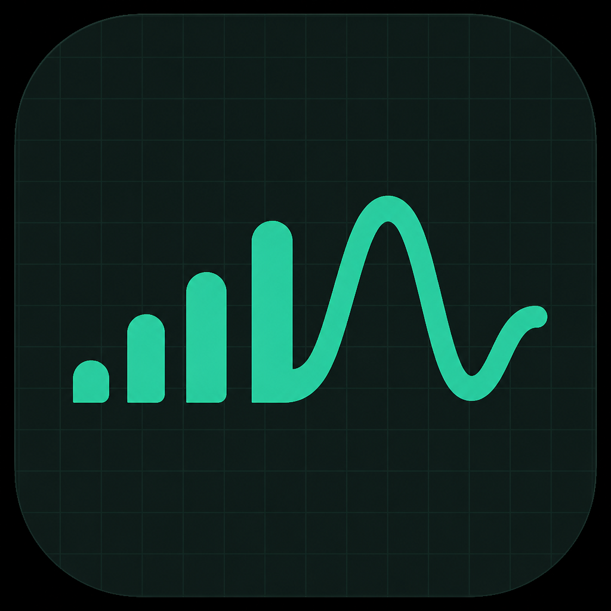
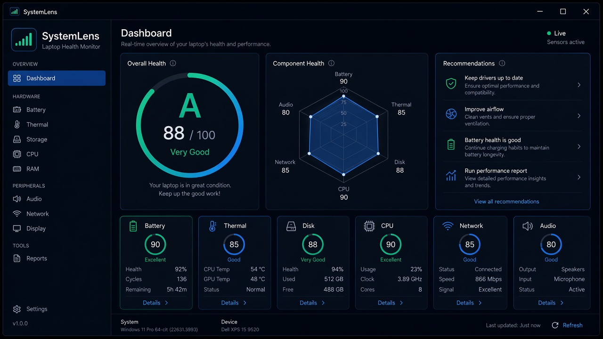
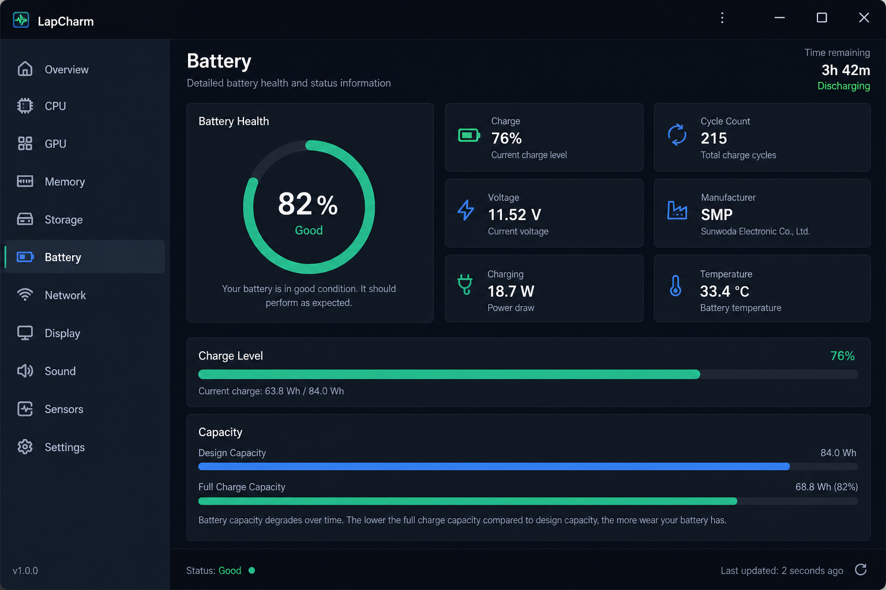
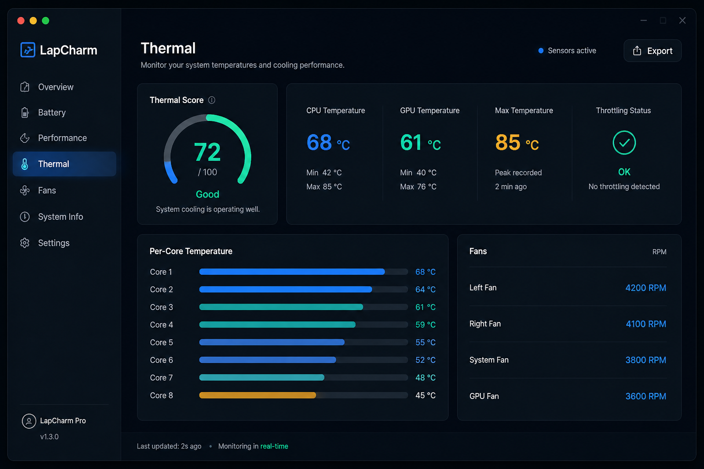
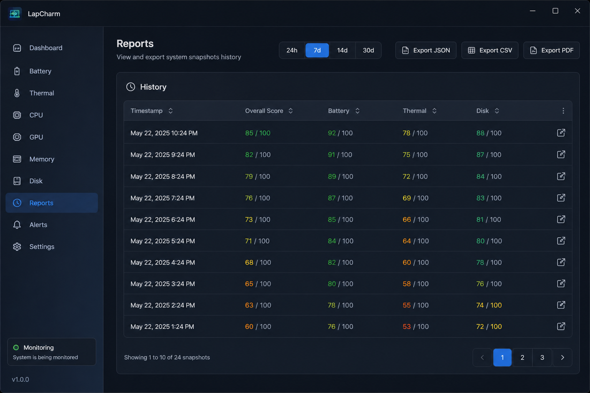
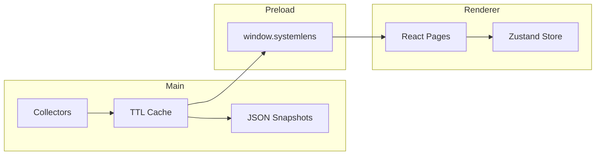

<p align="center">
  
</p>

# SystemLens

[](https://github.com/mahimapaseda/SystemLens/releases)
[](https://github.com/mahimapaseda/SystemLens/releases)
[](LICENSE)
[](https://mahimapaseda.github.io/SystemLens/)

**PC health check and laptop health monitor for Windows** — battery, thermals, disk, CPU, RAM, audio, network, and display diagnostics in a clean desktop app.

[Website](https://mahimapaseda.github.io/SystemLens/) · [Releases](https://github.com/mahimapaseda/SystemLens/releases) · [llms.txt](https://mahimapaseda.github.io/SystemLens/llms.txt)

<p align="center">
  
</p>

## Features

- **Overall health score** with letter grade and actionable recommendations
- **Seven diagnostic modules** — Battery, Thermal, Storage, CPU & RAM, Audio, Network, Display
- **History & export** — JSON, CSV, and PDF reports from saved snapshots
- **System tray shortcut** while the app is open, plus dark / light themes
- **Windows-native** data via `systeminformation` and PowerShell/WMI

## Screenshots

| Battery | Thermal |
|:---:|:---:|
|  |  |

| Storage | CPU & RAM |
|:---:|:---:|
|  |  |

<p align="center">
  
  <br />
  <em>History snapshots and JSON / CSV / PDF export</em>
</p>

> Illustrative mock UI screenshots for documentation — not live captures.

## Install

1. Download [SystemLens-Setup-Windows.exe](https://github.com/mahimapaseda/SystemLens/releases/latest/download/SystemLens-Setup-Windows.exe)
2. Run the NSIS installer (Windows x64)

Closing the window fully exits SystemLens.

## Development

```bash
npm install
npm run dev        # Electron + Vite hot reload
npm run build      # Compile main / preload / renderer
npm run package    # Windows NSIS installer → release/
```

Requires Node.js 18+ and Windows for full hardware collectors.

Packaging expects brand assets at `assets/icons/icon.png`, `assets/icons/icon.ico`,
`assets/icons/tray.png`, and `src/assets/logo.png`. Ensure those files exist before
`npm run package`.

## Architecture



| Layer | Path | Role |
|-------|------|------|
| Main | `electron/main/` | Window, tray, IPC, collectors, history DB |
| Preload | `electron/preload/` | Secure `contextBridge` API |
| Renderer | `src/` | React UI, Zustand, Recharts |

## License

MIT © SystemLens Team
